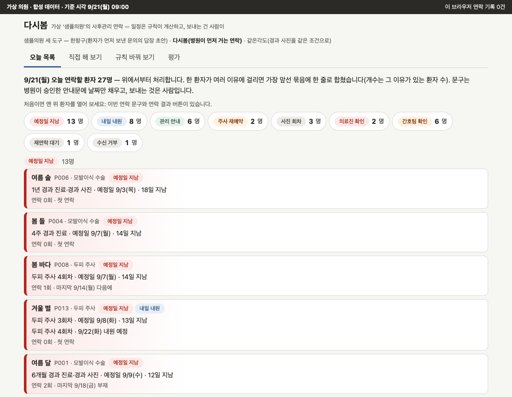
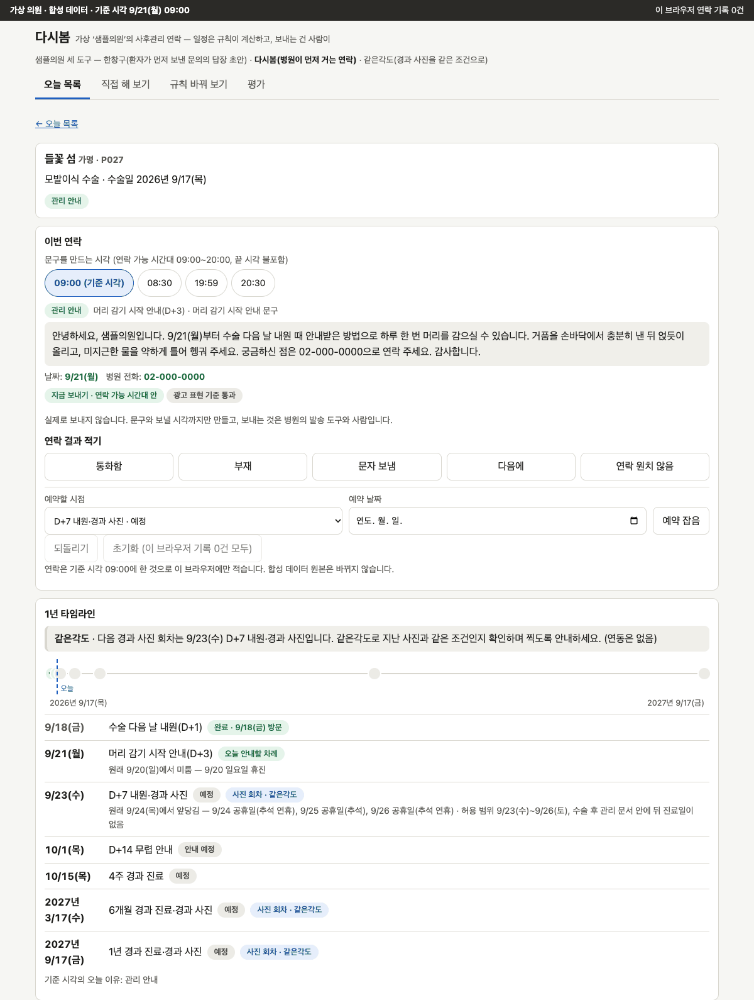
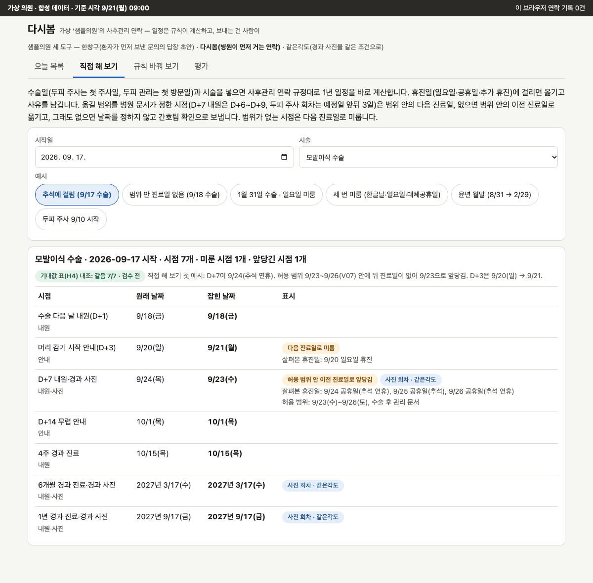

# 다시봄

수술·시술 뒤 챙겨야 할 연락을 놓치지 않게, 코디네이터에게 "오늘 연락할 환자"를 이유와 함께 보여 주는 도구입니다.

> 가상 의원 '샘플의원'과 지어낸 환자 127명으로 만든 시연입니다. 실제 병원 문서나 환자 정보는 없습니다.
> 주제 선정부터 코드까지 AI 코딩 도구(Claude Code)가 만들었습니다.

**시연:** https://dasibom-clinic.vercel.app (설치·로그인 없음. 연락 결과는 이 브라우저에만 적히고 실제로 보내지 않습니다.)

| ① 오늘 연락할 환자 | ② 한 환자의 일정 | ③ 직접 해 보기 |
|---|---|---|
| [](docs/screens/1-today.png) | [](docs/screens/2-timeline.png) | [](docs/screens/3-try.png) |
| 27명을 이유별로. 맨 위는 예정일 지남 13명 | P027의 1년 일정. 일요일·추석에 걸린 날을 옮기고 이유를 적음 | 9/17 수술이면 D+7(9/24 추석 연휴)이 9/23으로 앞당겨짐 |

화면 속 이름은 지어낸 가명입니다.

## 할 수 있는 것

- 예정일이 지났는데 안 온 환자, 내일 올 환자, 안내할 차례인 환자를 한 목록에 모읍니다.
- 관리 날짜가 일요일·공휴일·휴진일이면 진료하는 날로 옮기고 이유를 적습니다.
- 병원이 승인한 안내문에 날짜만 채워 줍니다. 보내는 건 사람입니다.
- 여러 번 안 닿은 환자는 '간호팀 확인'으로, 연락을 원치 않는 환자는 목록 밖으로 뺍니다.
- 규칙 값을 바꾸면 목록이 어떻게 달라지는지 도입 전에 미리 봅니다.

## 믿을 수 있게 만든 장치

- AI가 날짜를 정하지 않습니다. 정해진 규칙으로 계산해, 같은 입력이면 늘 같은 결과입니다.
- 규칙은 병원 문서에서만 읽고, 문서가 빠지거나 깨지면 추측하지 않고 멈춘 이유를 보여 줍니다.
- 정할 수 없는 날짜는 지어내지 않고 간호팀 확인으로 보내며, 증상은 판단하지 않습니다.

## 숫자

모두 가상 데이터로 잰 값입니다.

| 무엇을 봤나 | 결과 |
|---|---|
| 시연 날 아침, 오늘 연락할 환자 | 27명 |
| 일부러 섞어 둔 '안 온 환자' | 19명 모두 맞는 자리에 나옴 |
| 따로 계산해 둔 예상 결과와 같은 항목 | 540 / 540 |

예상 결과도 AI가 짠 계산이고 사람 검수 전이라, 정답 확인이 아니라 두 계산이 서로 같다는 뜻입니다.

## 실행 방법

Node `^20.19 || ^22.13 || >=24`. 모델을 부르지 않고, API 키도 필요 없습니다.

```bash
npm install
npm run dev        # http://localhost:3000
npm run verify     # test + typecheck + lint + build
```

## 한계

- 규칙 숫자(기다릴 날, 재연락 간격, 최대 연락 횟수 등)는 AI가 정한 임시값이며 의료진 검토 전입니다.
- 차트·예약 프로그램과 연결되지 않아, 방문과 예약을 여기에 한 번 더 입력해야 합니다.
- 실제 의원에서 써 본 적이 없고, 현장 인터뷰도 하지 않았습니다.

## 자세히

- [설계 문서(PRD)](docs/PRD.md) — 요구사항, 설계 결정, 리스크, 병원에 물을 질문
- [평가](docs/EVALUATION.md) — 잰 것과 재지 않은 것, 변이 검사
- [세부](docs/DETAILS.md) — 사용 흐름, 동작 구조, 한계 세부, AI와 사람이 나눈 일 등
- [데이터](data/README.md) — 합성 환자, 심은 사례, 예상 결과 계산 방법
- 같은 가상 의원의 다른 도구: [한창구](https://github.com/Min-heee/hanchanggu)(문의 답장 초안), [빈자리](https://github.com/Min-heee/binjari)(전화 예약 빈 시간), [같은각도](https://github.com/Min-heee/same-angle)(경과 사진)

## 기술 스택

Next.js 15(정적 내보내기) · React 19 · TypeScript · Vitest · 데이터 생성은 Python · 배포 Vercel
